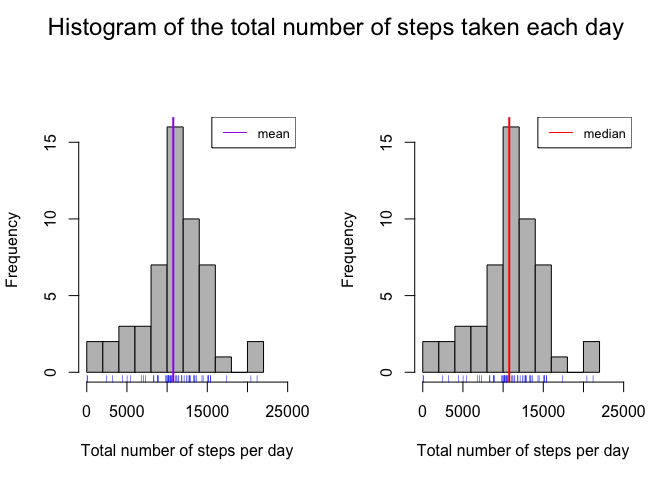

# Reproducible Research: Peer Assessment 1
# Author: Reza Katebi

## Loading and preprocessing the data
Here first we are going to *unzip* and *load* the activity data set:

```r
unzip("activity.zip", exdir = "activity")
Activity <- read.csv("./activity/activity.csv", stringsAsFactors = FALSE)
```
Now let's remove **NA**s from the data set:

```r
Activity_NoNA <- Activity[complete.cases(Activity), ]
```
Next, we are going to make the date column to be a *Date* format instead of 
*character*.

```r
Activity$date <- as.Date(Activity$date)
```
## What is mean total number of steps taken per day?
First, let's calculate the total number of steps taken per day and report the
the mean and median of the total number of the steps taken per day:

```r
total_per_day <- tapply(Activity_NoNA$steps, Activity_NoNA$date, sum)
mean(total_per_day)
```

```
## [1] 10766.19
```

```r
median(total_per_day)
```

```
## [1] 10765
```
Now let's make a histogram of the total number of steps taken per day with
*mean* and *median* shown:

```r
par(mfrow = c(1,2), oma = c(0,0,2,0))
hist(total_per_day, breaks = 10, col = "gray", 
     xlab = "Total number of steps per day", main = NULL,
     xlim = c(0,25000))
abline(v = mean(total_per_day), col = "purple", lwd = 2)
rug(total_per_day, col = "blue")
legend("topright", legend = "mean", lty = 1, col = "purple",cex = 0.8)

hist(total_per_day, breaks = 10, col = "gray", 
     xlab = "Total number of steps per day", main = NULL,
     xlim = c(0,25000))
abline(v = median(total_per_day), col = "red", lwd = 2)
rug(total_per_day, col = "blue")
legend("topright", legend = "median", lty = 1, col = "red", cex = 0.8)
mtext("Histogram of the total number of steps taken each day", 
      outer = TRUE, cex = 1.5 )
```

<!-- -->

## What is the average daily activity pattern?
Now let's make time series plot (i.e. `type = "l"`) of the 5-minute 
interval (x-axis) and the average number of steps taken, averaged across 
all days (y-axis):

```r
average_per_interval <- tapply(Activity_NoNA$steps, Activity_NoNA$interval, mean)
plot(average_per_interval, xlab = "5-minute interval",
     ylab = "Average number of steps", main = "Activity pattern (daily)",
     col = "navy", type = "l")
```

<!-- -->

Now let's report the 5-minute interval that contains the maximum number of steps:

```r
average_per_interval[average_per_interval == max(average_per_interval)]
```

```
##      835 
## 206.1698
```

## Imputing missing values
First, let's calculate the number of rows that contains **NA**s in the data set:

```r
sum(is.na(Activity))
```

```
## [1] 2304
```
Now let's replace **NA**s with the **mean** value of the correspondent interval:

```r
Activity_new <- Activity
Activity_new[is.na(Activity_new),]$steps <- average_per_interval[as.character(Activity_new[is.na(Activity_new),"interval"])]
```
Now let's calculate the total number of steps taken per day and report the mean 
and median values:

```r
total_per_day_NA_replaced <- tapply(Activity_new$steps, Activity_new$date, sum)
mean(total_per_day_NA_replaced)
```

```
## [1] 10766.19
```

```r
median(total_per_day_NA_replaced)
```

```
## [1] 10766.19
```
As we can see the mean stayed the same while the median changed just by 
one step :

```r
mean(total_per_day_NA_replaced) - mean(total_per_day)
```

```
## [1] 0
```

```r
median(total_per_day_NA_replaced) - median(total_per_day)
```

```
## [1] 1.188679
```
Now let's show them in the histogram:

```r
par(mfrow = c(2,2), oma = c(0,0,2,0))
hist(total_per_day_NA_replaced, breaks = 10, col = "gray", 
     xlab = "Total number of steps per day", main = "NA replaced",
     xlim = c(0,25000))
abline(v = mean(total_per_day_NA_replaced), col = "purple", lwd = 2)
rug(total_per_day_NA_replaced, col = "blue")
legend("topright", legend = "mean", lty = 1, col = "purple",cex = 0.8)

hist(total_per_day, breaks = 10, col = "gray", 
     xlab = "Total number of steps per day", main = "NA removed",
     xlim = c(0,25000))
abline(v = mean(total_per_day), col = "purple", lwd = 2)
rug(total_per_day, col = "blue")
legend("topright", legend = "mean", lty = 1, col = "purple",cex = 0.8)


hist(total_per_day_NA_replaced, breaks = 10, col = "gray", 
     xlab = "Total number of steps per day", main = NULL,
     xlim = c(0,25000))
abline(v = median(total_per_day_NA_replaced), col = "red", lwd = 2)
rug(total_per_day_NA_replaced, col = "blue")
legend("topright", legend = "median", lty = 1, col = "red", cex = 0.8)

hist(total_per_day, breaks = 10, col = "gray", 
     xlab = "Total number of steps per day", main = NULL,
     xlim = c(0,25000))
abline(v = median(total_per_day), col = "red", lwd = 2)
rug(total_per_day, col = "blue")
legend("topright", legend = "median", lty = 1, col = "red", cex = 0.8)

mtext("Histogram of the total number of steps taken each day", 
      outer = TRUE, cex = 1.5 )
```

<!-- -->
## Are there differences in activity patterns between weekdays and weekends?
Now let's make two new columns named **Days** and **Day_type** that contain the 
name of the day and the type of the day (weekdays or weekends):

```r
Activity_new$Days <- weekdays(Activity_new$date)
Activity_new$Day_type <- as.factor(c("weekend", "weekday"))
Activity_new[Activity_new$Days == "Saturday" | Activity_new$Days == "Sunday", "Day_type"] <- factor("weekend")
Activity_new[!(Activity_new$Days == "Saturday" | Activity_new$Days == "Sunday"), "Day_type"] <- factor("weekday")
class(Activity_new$Day_type)
```

```
## [1] "factor"
```
Now let's Make a panel plot containing a time series plot (i.e. `type = "l"`) of the 5-minute interval (x-axis) and the average number of steps taken, averaged across all weekday days or weekend days (y-axis):

```r
Activity_new_weekdays <- subset(Activity_new, Day_type == "weekday")
Activity_new_weekends <- subset(Activity_new, Day_type == "weekend")

average_per_ineterval_weekdays <- tapply(Activity_new_weekdays$steps, Activity_new_weekdays$interval,mean)
average_per_ineterval_weekends <- tapply(Activity_new_weekends$steps, Activity_new_weekends$interval,mean)

par(mfrow = c(2,1))
plot(average_per_ineterval_weekdays, type = "l",
     xlab = "5-minute interval",
     ylab = "Average number of steps",
     main = "Activity patterns weekdays")
plot(average_per_ineterval_weekends, type = "l",
     xlab = "5-minute interval",
     ylab = "Average number of steps",
     main = "Activity pattern weekends")
```

<!-- -->

As we see in the plots the activity pattern is very different in weekends compared 
to weekdays. As we see the activity starts almost one hour later on weekends. Also, the number of steps in intervals stay higher in weekends compared to weekdays. For showing the differences more clear we overplot weekends on weekdays in the following:

```r
plot(average_per_ineterval_weekdays, type = "l",
     xlab = "5-minute interval",
     ylab = "Average number of steps",
     main = "Activity patterns weekdays", lwd = 2)
lines(average_per_ineterval_weekends, col = "blue", lwd = 2)
legend("topright", legend = c("weekdays", "weekends"),
       col = c("black", "blue"),
       lty = c(1,1))
```

<!-- -->
